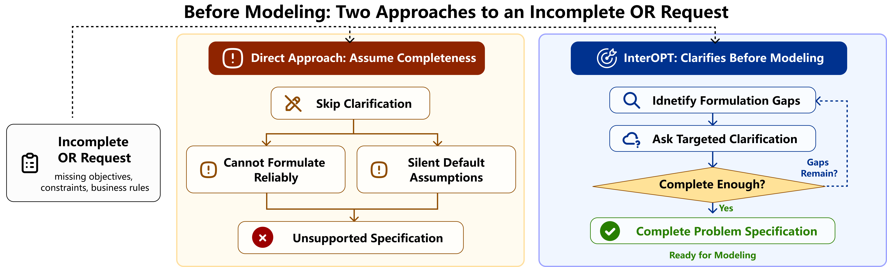
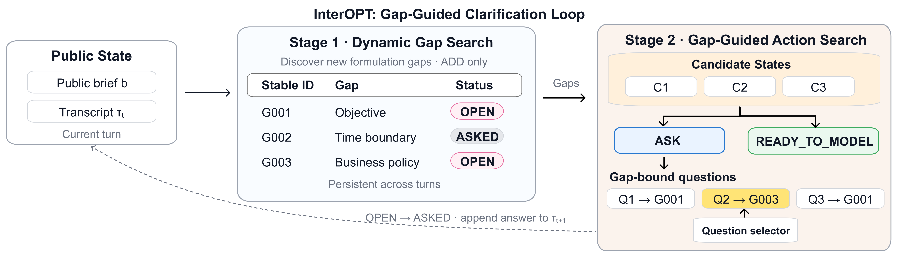
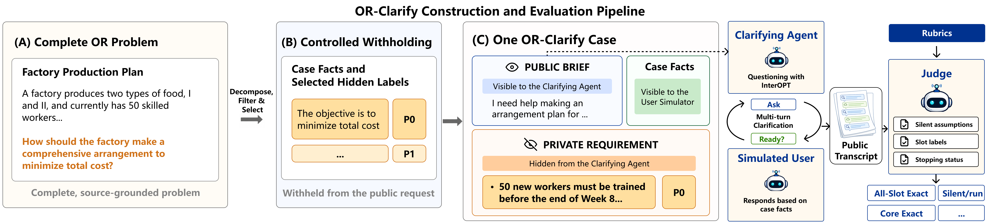
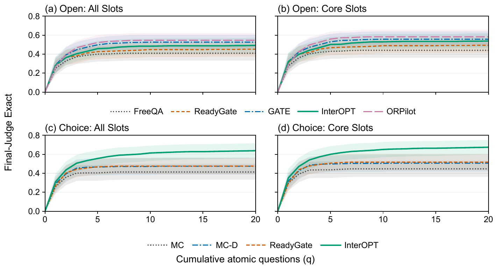

# Ask Before You Optimize

Official code and benchmark repository for **Ask Before You Optimize: Dynamic Pre-Formulation Clarification for Interactive Optimization**.

“Buy low, sell high” sounds simple—but can newly purchased stock be sold immediately? Must a fixed amount remain in storage at the end? Guessing these rules can mean optimizing the wrong problem. **InterOPT** asks targeted questions before formulation, while **OR-Clarify** evaluates whether agents uncover the missing requirements.

**Core contributors (equal contribution):** Sihan Ge, Yichen Lin, and Chenyu Zhou.  
**Paper authors:** Sihan Ge, Yichen Lin, Chenyu Zhou, Jianghao Lin, Tao Yao, and Dongdong Ge.  
**Corresponding authors:** Jianghao Lin and Tao Yao. Hosted by [AIOR-Research](https://github.com/AIOR-Research).



## A short example

**Business request:** Plan purchases and sales over several periods to maximize profit, within a fixed warehouse capacity.

*Two selected turns from a Choice (MC-D) InterOPT run, shortened and anonymized; intervening turns are omitted.*

> **Agent:** What happens to unsold stock at the end of the plan?
>
> **A.** Discard it with no value.  
> **B.** Sell it at the final-period price.  
> **C.** Value it at the purchase price and add it to profit.  
> **D.** None of the above — I'd like to explain in my own words.
>
> **User:** D. We must retain exactly the required quantity as ending inventory. It stays in storage, rather than being sold, discarded, or counted as profit.

**The agent also checks resale timing:**

> **Agent:** Can newly purchased stock be sold in the same period?
>
> **A.** Yes, it is available for sale immediately.  
> **B.** No, sales can only come from stock held at the start of the period.  
> **C.** Only if starting inventory cannot meet demand.  
> **D.** None of the above — I'd like to explain in my own words.
>
> **User:** B.

These answers add two concrete constraints: no same-period resale and an exact ending-inventory target.

## How it works

**Dynamic Gap Search** tracks formulation gaps across turns. **Gap-Guided Action Search** uses them to guide the next question or declare readiness. Both stages work from the public brief and conversation.



## Quick start

### Set up

Use a Python 3.11+ environment. The commands below use Bash (Linux, macOS, or Git Bash on Windows).

```bash
git clone https://github.com/AIOR-Research/ask_before_you_optimize.git
cd ask_before_you_optimize
python -m pip install -r requirements.txt
cp -n .env.example .env
```

Edit `.env`: set `DEEPSEEK_API_KEY` and `DEEPSEEK_BASE_URL`, and choose model identifiers supported by your endpoint for the `*_MODEL` entries. Choice runners load this file automatically. **Running the example calls hosted LLM APIs and may incur charges.**

### Run one case

This is a single-case smoke test: it confirms the full InterOPT pipeline runs end to end before you spend time and API budget on the complete evaluation.

```bash
python experiments/interopt/run_parallel.py \
  --toml_dirs data --case_ids 001 --interaction_modes mc_d \
  --k 1 --max_turns 20 --max_concurrency 1 \
  --gap_search_prompt_path experiments/interopt/prompts/prompt-ledger-gap-search.md \
  --agent_prompt_supplements experiments/interopt/prompts/agent_ledger_supplement.md \
  --selector_prompt_supplements experiments/interopt/prompts/selector_ledger_supplement.md \
  --output_dir runs/quickstart
```

Keep the three prompt arguments: they configure the full two-stage method.

### Check the result

When the run finishes, open `interopt_eval_report.md` for the summary, then `transcript.md` to inspect the public conversation:

```text
runs/quickstart/
├── interopt_eval_report.md
├── summary_interopt_eval.json
└── mc_d/generic_agent/run_01/orclarify_001/
    ├── transcript.md
    └── judge_result.json
```

The single case checks the workflow. For a full Choice InterOPT evaluation, use the [100-case, K=5 command](experiments/interopt/README.md#run).

## Benchmark and experiments

OR-Clarify contains **100 TOML cases** and **178 hidden requirements**. The [data card](data/DATA_CARD.md) explains the case fields and the information available to each role. Choice uses structured answer options; Open uses free-form answers.

[](assets/or-clarify-workflow.png)

*Figure 2 from the paper. From complete problems to clarification cases and transcript-based evaluation. Click the image to enlarge.*

The packaged methods are linked below. Runners expose their command-line options through `--help`.

| Method          | Choice                                                 | Open                                                         |
| --------------- | ------------------------------------------------------ | ------------------------------------------------------------ |
| InterOPT        | [Guide](experiments/interopt/README.md)                | [Runner](experiments/open_interopt/run_pipeline.py)          |
| w/o Stage 1     | [Guide](experiments/interopt_without_stage1/README.md) | [Runner](experiments/open_interopt_without_stage1/run_pipeline.py) |
| w/o Stage 2     | [Guide](experiments/interopt_without_stage2/README.md) | [Runner](experiments/open_interopt_without_stage2/run_pipeline.py) |
| MC / MC-D       | [Guide](experiments/choice_mc_mcd/README.md)           | —                                                            |
| ReadyGate       | [Guide](experiments/readygate/README.md)               | —                                                            |
| ORPilot adapter | —                                                      | [Guide](experiments/orpilot/README.md)                       |
| T-P-P adapter   | —                                                      | [Guide](experiments/lets_tpp/README.md)                      |

For the Open InterOPT runners, export the variables from `.env` into your shell before execution; these runners read the process environment directly. ORPilot and T-P-P cover only the adapted interaction stages described in their [ORPilot scope](experiments/orpilot/METHOD_SCOPE.md) and [T-P-P scope](experiments/lets_tpp/METHOD_SCOPE.md) notes.

## Results at a glance



*Figure 4 from the paper. Curves average five runs per case, with shaded bands showing 95% case-level bootstrap confidence intervals. Compare methods within each protocol.*

Under Choice, InterOPT reaches higher recovery while asking more questions. Open shows a different ranking, with ORPilot ahead of InterOPT in endpoint recovery.

**Read the scores.**

- **All-Slot Exact** — the share of runs that recover *every* hidden requirement.
- **Core Exact** — the same all-or-nothing test, but only over the P0/P1 requirements (the 94 cases that have them).
- **Avg Q** — the average number of independently answerable (atomic) questions per run. A single turn may contain several such questions.
- **Avg Turns** — the average number of agent turns per run, including the final `READY_TO_MODEL` action when present. That stopping turn adds no questions.
